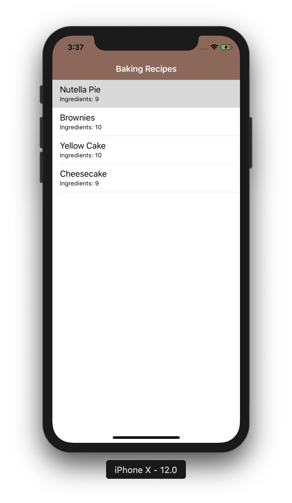
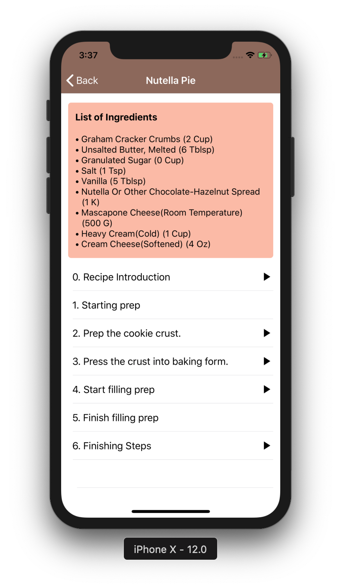
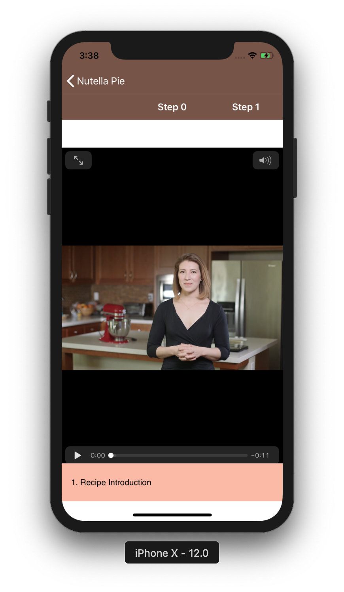
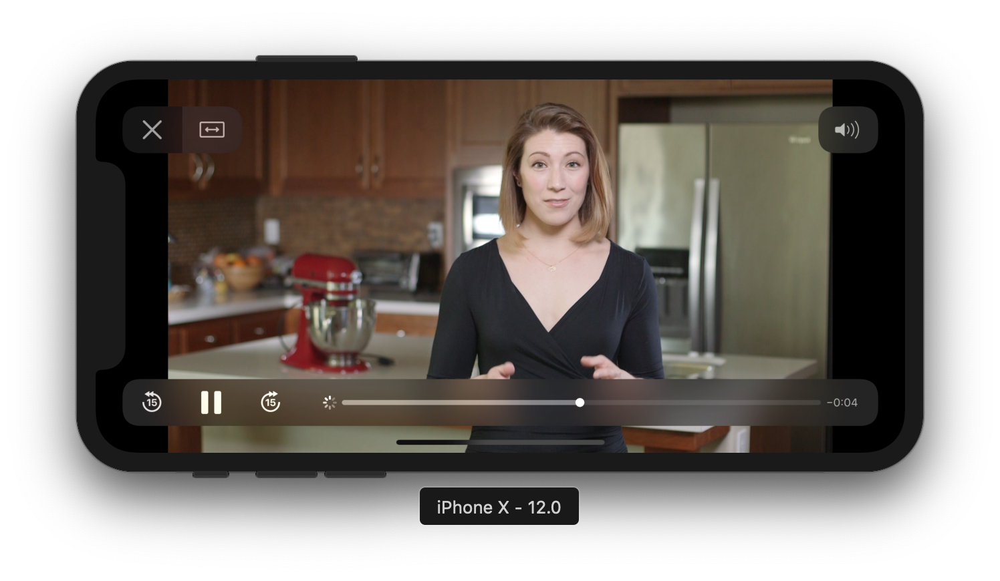

# BakingApp iOS

An iOS equivalent App of my [BakingApp](https://github.com/codedentwickler/BakingApp) Android Project

This app uses the MVP architecture for iOS.
Shows a list of baking recipes and include video explaining the steps involved in baking the recipes.

<p align="center">




</p>

## Requirements

- iOS 9.0+
- Install the latest version of xCode.
- Swift version 4 was the last version of Swift used.

### Getting Started ###

* Clone the repository 

Run `git clone https://github.com/codedentwickler/BakingAppIOS.git`


## Setup
- Close Xcode
- Open a terminal window, and `$ cd` into your project directory.
- Run `$ pod install` if you are installing for the first time
- You may require to run `$ pod update`
- `$ open TheBakingApp.xcworkspace` and build.

### Pods

- [Alamofire](https://github.com/Alamofire/Alamofire): Elegant HTTP Networking in Swift

- [EVReflection](https://github.com/evermeer/EVReflection): Reflection based (Dictionary, CKRecord, NSManagedObject, Realm,                     JSON and XML) object mapping with extensions for Alamofire

- [MBProgressHUD](https://github.com/jdg/MBProgressHUD): It is an iOS drop-in class that displays a translucent HUD with an indicator and/or labels while work is being done in a background thread.

- [SHViewPager](https://github.com/shabib87/SHViewPager): A simple view pager for iOS. Compatible with iOS 8.0 or later.

### Contributors on GitHub
Please feel free to make a pull request. There is so much to improve on.

#### Developer
* e-mail : kanyinsolafapohunda@gmail.com
* Twitter: [@kanyinsola_f](https://twitter.com/kanyinsola_f "kanyinsola_f on twitter")


##### LICENSE

```
MIT License

Copyright (c) [2018] [Kanyinsola Fapohunda Oyindamola]

Permission is hereby granted, free of charge, to any person obtaining a copy
of this software and associated documentation files (the "Software"), to deal
in the Software without restriction, including without limitation the rights
to use, copy, modify, merge, publish, distribute, sublicense, and/or sell
copies of the Software, and to permit persons to whom the Software is
furnished to do so, subject to the following conditions:

The above copyright notice and this permission notice shall be included in all
copies or substantial portions of the Software.

THE SOFTWARE IS PROVIDED "AS IS", WITHOUT WARRANTY OF ANY KIND, EXPRESS OR
IMPLIED, INCLUDING BUT NOT LIMITED TO THE WARRANTIES OF MERCHANTABILITY,
FITNESS FOR A PARTICULAR PURPOSE AND NONINFRINGEMENT. IN NO EVENT SHALL THE
AUTHORS OR COPYRIGHT HOLDERS BE LIABLE FOR ANY CLAIM, DAMAGES OR OTHER
LIABILITY, WHETHER IN AN ACTION OF CONTRACT, TORT OR OTHERWISE, ARISING FROM,
OUT OF OR IN CONNECTION WITH THE SOFTWARE OR THE USE OR OTHER DEALINGS IN THE
SOFTWARE
```
